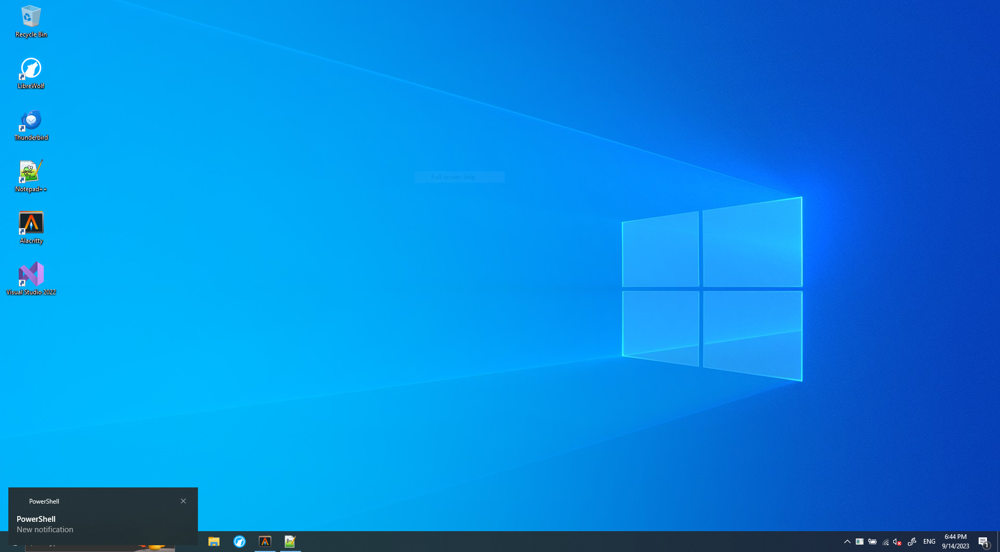
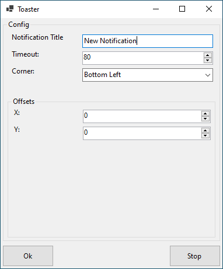
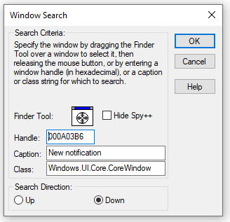

# Toaster

Put toast notifications where you want them.
Inspired by [notifications-at-top](https://github.com/SamarthCat/notifications-at-top).

# Screenshots

	
Windows 10

	
	

	
Windows 11

	
	TODO

	
Configuration

  
	

# FAQ

## This program has a high CPU usage!

Try setting "Timeout" in the configuration to a higher value.

### Technical details

The program periodically checks for toast windows to move.
"Timeout" specifies (in milliseconds) how long the program should sleep inbetween those checks.
Thus the lower the timeout is the more the program requests for CPU time (even if there is no toast window to move).

## What can I do if my language is not supported?

Don't worry. You can easily add support yourself!
However, to do this you need to install [Visual Studio for Spy++](https://learn.microsoft.com/en-us/visualstudio/debugger/using-spy-increment?view=vs-2022).
You can also use another (smaller) tool like [WinSpy](https://github.com/strobejb/winspy) but I'll be using Spy++ in this guide.

After opening Spy++ go to `Search > Find Window`.
A new window should appear with a "Finder Tool" and a draggable cross hair on its right.

Drag this cross hair over a toast notification window (You can spawn one manually with e.g. [PowerShell](https://gist.github.com/dend/5ae8a70678e3a35d02ecd39c12f99110)).
Now the text box labeled "Caption" should include a value you can use for the "Notification Title" field in Toaster's configuration form.

**Please open a Github Issue (or better send a Pull Request if you know how) and share this value (and your language) so it can be included in the program.**
This way the language can be automatically configured for other users that use the same language.

## Is this malware?

No.

Or is it?
You should not blindly trust a stranger on the internet.
Neither your Anti Virus software as it's will have false negatives (or positives).
If you really want to be sure then read the source code and compile it yourself.

<!-- ;-)
## Do you hate Windows?

Yes and while writing this program I found even more reasons to do so.
-->